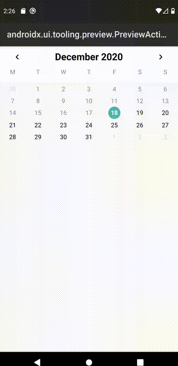
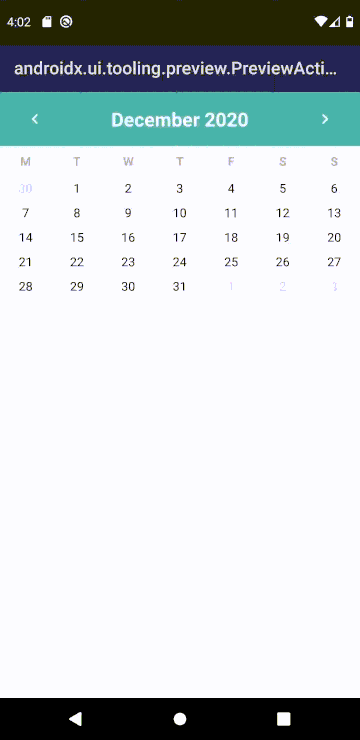

[](https://jitpack.io/#sigmadeltasoftware/CalPose)

Calpose is a lightweight, easy-to-use Calendar renderer/widget for Android/Jetpack Compose.

## Renderer? 
The goal of Calpose is to avoid imposing rules or limitations in regards to the styling of the calendar. We want you to have full control
over the UI aspects using Composable widgets while Calpose deals with the Calendar instrinsics. In other words, Calpose will act as a 
renderer for your widgets based on the Calendar.

## Features
### Default Widgets

[DefaultPreview.kt](https://github.com/sigmadeltasoftware/CalPose/blob/master/app/src/main/java/be/sigmadelta/calpose/DefaultPreview.kt "Default widget example")


[MaterialPreview.kt](https://github.com/sigmadeltasoftware/CalPose/blob/master/app/src/main/java/be/sigmadelta/calpose/MaterialPreview.kt "Material widget example")

## Installation
Add Jitpack to your project build.gradle
```
allprojects {
    repositories {
        ...
        
        // When using build.gradle
        maven { url 'https://jitpack.io' } 
        
        // When using build.gradle.kts
        maven {
            setUrl("https://jitpack.io")
        }
    }
}
```

Add the dependency to your module, see top for `${CURRENT_VERSION}`
```
dependencies {
    // build.gradle
    implementation 'com.github.sigmadeltasoftware:CalPose:${CURRENT_VERSION}'

    // build.gradle.kts
    implementation("com.github.sigmadeltasoftware:CalPose:${CURRENT_VERSION}")
}
```
## Usage
* WIP

Currently consult the [DefaultPreview.kt](https://github.com/sigmadeltasoftware/CalPose/blob/master/app/src/main/java/be/sigmadelta/calpose/DefaultPreview.kt "Default widget example")
& [MaterialPreview.kt](https://github.com/sigmadeltasoftware/CalPose/blob/master/app/src/main/java/be/sigmadelta/calpose/MaterialPreview.kt "Material widget example")
examples to get a good idea of how to render a calendar.

## License
MIT License

Copyright (c) 2020 Bojan Belic - Sigma Delta Software Solutions

Permission is hereby granted, free of charge, to any person obtaining a copy
of this software and associated documentation files (the "Software"), to deal
in the Software without restriction, including without limitation the rights
to use, copy, modify, merge, publish, distribute, sublicense, and/or sell
copies of the Software, and to permit persons to whom the Software is
furnished to do so, subject to the following conditions:

The above copyright notice and this permission notice shall be included in all
copies or substantial portions of the Software.

THE SOFTWARE IS PROVIDED "AS IS", WITHOUT WARRANTY OF ANY KIND, EXPRESS OR
IMPLIED, INCLUDING BUT NOT LIMITED TO THE WARRANTIES OF MERCHANTABILITY,
FITNESS FOR A PARTICULAR PURPOSE AND NONINFRINGEMENT. IN NO EVENT SHALL THE
AUTHORS OR COPYRIGHT HOLDERS BE LIABLE FOR ANY CLAIM, DAMAGES OR OTHER
LIABILITY, WHETHER IN AN ACTION OF CONTRACT, TORT OR OTHERWISE, ARISING FROM,
OUT OF OR IN CONNECTION WITH THE SOFTWARE OR THE USE OR OTHER DEALINGS IN THE
SOFTWARE.